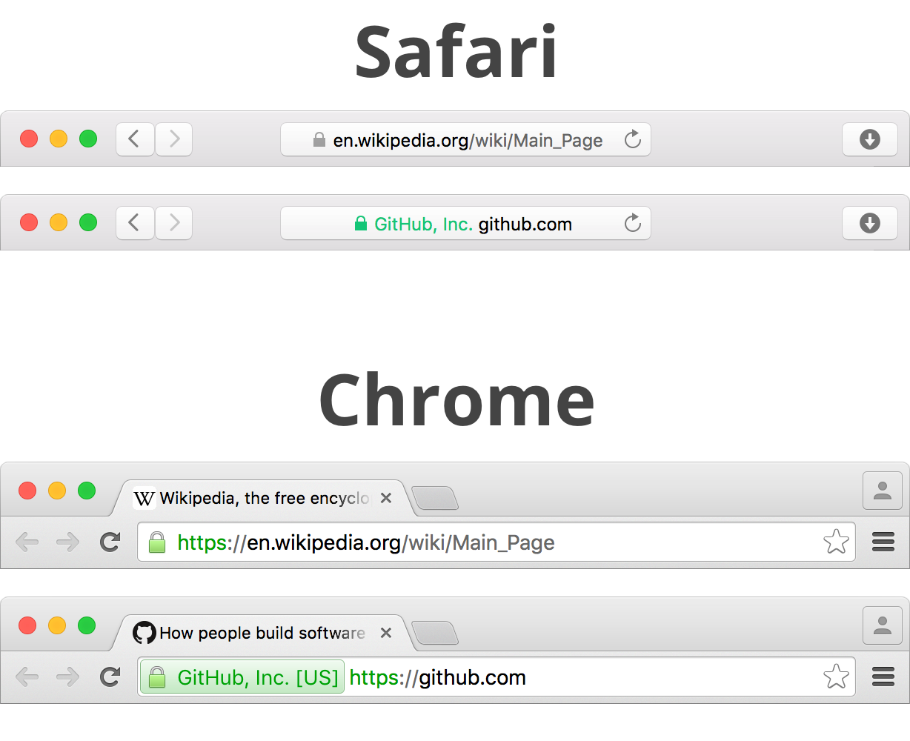

## Certificates

You can think of certificates like your driver's license: all your identifying information bundled up into a document. It has everything that proves that you are authentically... well, _you_. When you want to drive or drink legally (not at the same time!), you are asked for your information. But if you only claimed, "Hey, I'm 21 years old and a citizen of this country", that wouldn't convince anyone. You need that license.

To get a license, you need to go to a government building for issuing licenses and fill out some forms. Now you have something that A) identifies you and B) is trusted by others. The government trusts the people in this building and the building trusts you. This is called a **chain of trust**. This also allows the wider world (or at least country) to trust you when you show them your license.

In this analogy, your license is your certificate. It's stamped by the government (which represents the certificate being created) because you filled out the right paperwork for a license (i.e., a certificate signing request).

### Certificate Authorities

Also abbreviated CA, this is where we'll buy our TLS (also called SSL) certificate from. All CAs have a public certificate which can be used to verify that pieces of information have come from them. In fact, visitors to our site or service will use them to verify our certificate. More on that later.

Some CAs are called "root certificate authorities," so we call their certificates "root certificates". All operating systems these days come with a bunch of these root certificates, which start the chain of trust I mentioned earlier. To see a list of root CAs installed on your computer, search the web for `<operating system> trusted root certificates` and insert your operating system. You'll find a long list of certificates that all have very enterpise-y sounding names like _UltraCorp Secure_ or _DonkeyCom Gold_.

### Public-key Infrastructure

This whole network of certificates, certificate authorities, and the chain of trust uses a system called public-key infrastructure or PKI.

It starts with a **public/private key pair**, which are two files (public key and private key) that are "cryptographically matched." This means that a public key can encrypt data that _only_ the private key can decrypt. Also, because they are matched, if either key is tampered with even just a tiny bit, they become completely unmatched and will be unable to encrypt/decrypt for each other. We will be making a key pair for our server. All CAs already have one.

Public keys, as their name suggests, are public. In fact, whatever CA we choose will have a public key that anyone can see. All CAs do this, and we will too. Private keys, on the other hand, are the exact opposite. They need to be kept 100% secret and secure. I'll be harping on this for the rest of the chapter: **private keys stay private!**

When we want a certificate from a CA, we generate a key pair. We send them the public key along with some other information about us and our domain name. They bundle that up and send it back as a certificate. It contains our public key, a **signature** from the CA, and meta-information such as what CA it came from, how it was created, and more.

That signature is a new piece of this puzzle. The CA creates one by first taking our public key and turning it into a **digest**. A digest is made by transforming (or [hashing](https://en.wikipedia.org/wiki/Cryptographic_hash_function)) some input into some output of a standard length. Think of it as a fingerprint of our public key: a much smaller, identifying version of us that is the same every time. Second, the CA makes the signature by combining this digest along with their **private key**.

By the way, this private key from the CA is just like the private key we will create. It's kept secret _just like you should keep yours secret_ and has an associated public key. The CA's public key is the same public key that is stored on all major operating systems.

This all comes together when someone visits our secure website (or server) and the browser (or client) downloads the certificate we've set up. That certificate contains our **public key**, the **signature**, and some other meta-information, such as who created it and what information the certificate is certifying. In our case, we're certifying our domain name.

The browser then takes our public key from inside the certificate and creates a digest, just like the CA did. Next, it looks to see which certificate authority issued the certificate and grabs that public key from the operating system.

It then uses the CA's public key, the digest, and the signature from the certificate to verify that the public key is A) ours and B) hasn't been tampered with: **certificate authority's public key** + **digest** + **signature** = **verification**. If the verification comes back as okay, it proves that we are who we say we are, and we can now be trusted by the browser!

After that, the server and the browser set up a secure connection (we'll talk about this connection a little later), and all data from there on out is encrypted. _Phew!_

### Different Levels of Validation

There are three different levels of validation. These levels are representations of how much you have proven to a certificate authority. The first is a simple **domain validated** (or **DV**) certificate. This is by far the simplest and only requires that you prove you have control over a domain. Proof can be obtained when the CA sends an email to an address listed in the domain's WHOIS information or sends an email to a common email address like `admin@yourdomain.com` or `webmaster@yourdomain.com`.

If we don't have email set up for that domain or WHOIS privacy is turned on, there will be no email addresses to send to. In that case, there are usually other ways to validate the domain. For example:

* Put a text file with a very specific name on our web server for that domain. The CA will then check for this text file.
* Create a DNS record like a [CNAME](#cname) or [TXT](#txt) record that the CA can check for.

Both of these low-hassle methods prove that we own the domain.

More complicated but more trustworthy for visitors than a DV certificate is an **organization validated** (or **OV**) certificate. This requires legal proof that your organization exists, such as:

* The business's address in an official government database or other third-party database
* Articles of incorporation, business license, company bank statement, and other similar documents
* The driver's license or passport of the applicant
* A recent major utility bill

This can vary between certificate authorities but, as you can tell, it's much more involved. Interestingly, these certificates are actually somewhat hard to find. You most often find DV's or their more robust sibling:

**Extended validated** (**EV**) certificates are the most rigorous of all, requiring many levels of proof. For example, [Comodo requires](https://support.comodo.com/index.php?/Default/Knowledgebase/Article/View/253/0/what-is-required-for-validation) the proof of:

* Legal existence and identity
* Trade/Assumed Name as applicable
* Operational existence
* Physical address and organization phone number
* The name, title, authority, and signature of the person(s) involved in requesting the certificate and agreeing to the terms and conditions

While this kind of certificate is the most effort, it is rewarded with a special badge in the URL bar. Go to a site like [GitHub](https://github.com) and see the green badge next to the URL. That is an extended validated certificate in action. Compare that with a site like [Wikipedia](https://en.wikipedia.org), which only has a domain validated certificate. Most browsers will let you click on that lock or badge and see the certificate details and the chain of trust. That chain leads all the way back up to the root certificate, which we mentioned above.

The advantages of OV or EV certificates over a DV are unclear. There's certainly no harm in having more verification, other than the extra time, effort, and money it takes to set up. You can expect to pay about 5-10x more money for an EV, and it can take several weeks to be verified. There's no extra encryption that comes with them either. From a passing-around-data perspective, they are all equally secure.

One rationale for OV or EV certificates is this: "Customers will trust a website with a larger, greener, more official-looking badge." In this writer's opinion, most customers don't even notice. Those that do notice are not likely to look into the legitimacy of the certificate that much. My advice is start with a DV. It will get you up and running with a secure website faster, which is a legitimate benefit. If you need to upgrade to an OV or EV later, the option's always open.

### Wildcard

One restriction to a plain DV certificate, however, is we can only encrypt a single domain. We pick something like `donkeyrentals.com` and that's it. If we need to secure subdomains, we can get a wildcard certificate.

This lets us secure `*.donkeyrentals.com`. That is, any domain attached to `donkeyrentals.com` such as `blog.donkeyrentals.com` or `shop.donkeyrentals.com` can now be secure too. Note, however, that we can't secure `secret.blog.donkeyrentals.com`. Only one level of subdomains [is permitted](http://stackoverflow.com/questions/2115611/wildcard-ssl-on-sub-subdomain/9743652#9743652). Wildcard certificates usually cost about 2-4x more than a regular DV, but if multiple subdomains enter the picture, it can often pay for itself.
