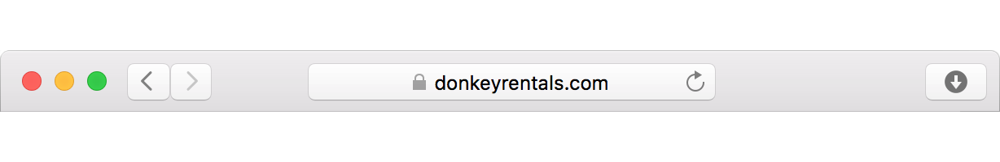

## Installing a Certificate for nginx

### What We Need

First, we'll need to be able to access our server. This is usually done through SSH, which I will assume you have set up already. Also, make sure that we have the certificate files we got from our CA:

* `donkeyrentals_com.crt`
* `donkeyrentals_com.ca-bundle`
* `donkeyrentals_com.key`

Finally, we'll need to install `nginx` and `openssl`. To find out if nginx is already installed, we connect to the server and type:

```shell
nginx -v

nginx version: nginx/1.6.3
```

To see if openssl is installed:

```
$ openssl version

OpenSSL 1.0.2g  1 Mar 2016
```

If we get something back that says `command not found`, then the package is not installed. If that's the case, our [package manager](#installing-tools) (yum, brew, apt, choco, etc.) should be able to install them for us.

### Combine the Certificates

nginx needs the certificates combined into one file. The order of the files should be:

```
Our certificate
Intermediate certificates
Root certificate
```

Our certificate authority should give you instructions on how to do this and the exact order they want the certificates in. They will (or _should_) also provide us with any certificates we don't have. We're essentially creating a file that starts with our certificate and tracing a path back to the root certificate, via our CA.

We can combine them on our local computer. For example:

```shell
$ cat donkeyrentals_com.crt donkeyrentals_com.ca-bundle > ssl-bundle.crt
```

Now we have one big certificate file (`ssl-bundle.crt`) that contains our certificate, any intermediate certificates, and, finally, the root certificate.

### Upload Those Certificates and Key

Next, we need to put the files on our server. I like to put them in the `/etc/ssl` directory. The certificate bundle we just created goes in `/etc/ssl/certs/ssl-bundle.crt`, and the private key goes in `/etc/ssl/private/donkeyrentals_com.key`. These don't have to go here specifically, but it's a good convention for nginx, and I'll assume they are in these directories for the rest of the tutorial.

Also, make sure our `/etc/ssl/private` directory has good permissions. Only the root user should be able to access it:

```shell
$ chmod 700 /etc/ssl/private/
$ chown root /etc/ssl/private/
$ chgrp root /etc/ssl/private/
```

### Configure nginx

We can make a new file in our nginx config directory for our website. Mine is at `/etc/nginx/conf.d/donkeyrentals.conf`. Here is the file in full:

```
server {
  listen 443;
  server_name donkeyrentals.com;
  root /var/www/donkeyrentals;

  ssl on;
  ssl_certificate /etc/ssl/certs/ssl-bundle.crt;
  ssl_certificate_key /etc/ssl/private/donkeyrentals_com.key;
  ssl_protocols TLSv1 TLSv1.1 TLSv1.2;
  ssl_ciphers "EECDH+AESGCM:EDH+AESGCM:AES256+EECDH:AES256+EDH";
  ssl_prefer_server_ciphers on;
}
```

Let's walk through each line:

* `listen 443;`

The server should listen for connections on port 443. This is the conventional port for TLS connections. When we visit a site at `https://` as opposed to `http://`, it will try to make a request using port 443 instead of the standard port 80.

* `server_name donkeyrentals.com;`

When requests come in for `donkeyrentals.com` to our server (on port 443), they will now be dealt with instead of thrown away. This must match the common name we used to create the CSR earlier.

* `root /var/www/donkeyrentals;`

The location of our html (and other) files for donkeyrentals.com on this server.

* `ssl on;`

Enable TLS/SSL.

* `ssl_certificate /etc/ssl/certs/ssl-bundle.crt;`
* `ssl_certificate_key /etc/ssl/private/donkeyrentals_com.key;`

The locations of our `ssl-bundle.crt` and `donkeyrentals_com.key` files. Again, these are what I consider to be sensible locations for these files, but they can technically go anywhere. Keep that `.key` private like your donkey-renting life depends on it.

* `ssl_protocols TLSv1 TLSv1.1 TLSv1.2;`

Enable only the newer TLS protocols. This implicitly disables old, outdated, and vulnerable versions of SSL so they can't be exploited by hackers.

* `ssl_ciphers "EECDH+AESGCM:EDH+AESGCM:AES256+EECDH:AES256+EDH";`

Set the ciphers that the client is allowed to use for encryption. There are many different ciphers used to encrypt data when we have a secure connection. The list above is one [currently recommended](https://cipherli.st) set of ciphers. A full list of ciphers can be seen [here](https://openssl.org/docs/manmaster/apps/ciphers.html).

_Side note: picking which cypher suites to use is tricky. It depends on our server, the client, the current state of security, and many other factors. If you want to learn more, there are [lots](https://cipherli.st) of [resources](https://www.ssllabs.com/projects/best-practices/index.html) that [have](https://httpd.apache.org/docs/2.2/ssl/ssl_howto.html) more [information](http://security.stackexchange.com/questions/76993/now-that-it-is-2015-what-ssl-tls-cipher-suites-should-be-used-in-a-high-securit)._

* `ssl_prefer_server_ciphers on;`

Use the server's encryption algorithms instead of the client's when using TLS.

### Final Steps

Really all that's left is to reload nginx and check out our server. Visit [https://donkeyrentals.com](https://donkeyrentals.com) (note the **s**), and we should see a little lock next to the URL. If so, nice work! If not, well, time to go back and read all those instructions again. A day in the life of a server administrator.


